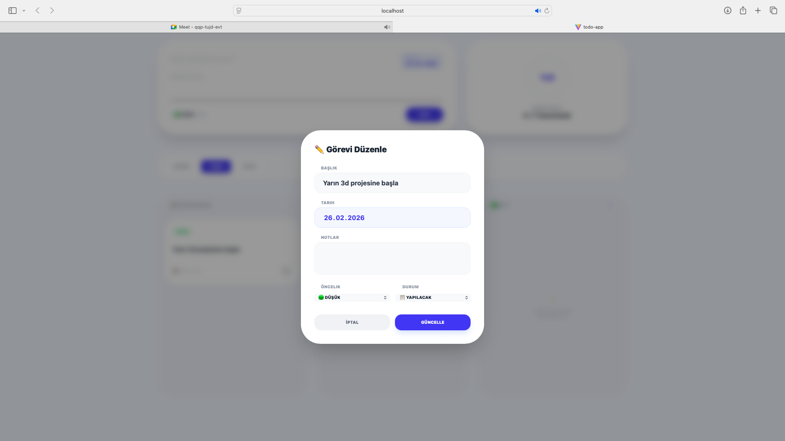

# 🚀 SudeSenturk_WebGelistirmeProjesi_ToDoApp

### 📋 To-Do App Staj Projesi Hakkında
Bu uygulama, kullanıcıların günlük görevlerini **CRUD** (Create, Read, Update, Delete) prensiplerine uygun olarak yönetebilmesini sağlayan dinamik bir görev yönetim platformudur.

---

### 🖥️ Geliştirme Süreci
* **Yerel Geliştirme:** Kod yazımı, hata ayıklama ve arayüz tasarımı aşamalarını kendi yerel ortamımda yürüttüm.
* **Test ve Kalite:** Uygulamanın farklı senaryolarda (görev ekleme, tamamlama, silme) doğru çalışıp çalışmadığını manuel test süreçleriyle deneyimledim.
* **Modern Araçlar:** Vite ve React gibi modern geliştirme araçlarını kullanarak, gerçek dünya projelerinde kullanılan iş akışlarını bizzat uygulama ve pekiştirme fırsatı buldum.

---

### 🛠️ Kullanılan Teknolojiler & Özellikler
* **Frontend:** React + Tailwind CSS
* **Versiyon Kontrol:** Git & GitHub
* **Veri Saklama:** LocalStorage ile veri persist etme (sayfa yenilense bile görevler kaybolmuyor)
* **Yeni Kullanıcı Ekleme:** Form üzerinden kullanıcı/görev ekleme ✅
* **Kullanıcı Silme:** İstenmeyen görevleri kaldırma ✅

---

### 📁 Proje Klasör Yapısı (Folder Structure)
Uygulama, sürdürülebilirlik ve kodun okunabilirliğini artırmak amacıyla modüler bir mimari ile inşa edilmiştir:

```text
todo-app/
├── src/
│   ├── components/           # Tekrar kullanılabilir arayüz bileşenleri
│   │   ├── ProgressCircle.jsx# Görev tamamlanma oranını gösteren grafik
│   │   ├── TaskCard.jsx      # Her bir görevin görsel kart yapısı
│   │   └── EditModal.jsx     # Görev düzenleme için açılır pencere
│   ├── pages/                # Sayfa bazlı ana bileşenler
│   │   └── Dashboard.jsx     # Uygulamanın ana yönetim ekranı
│   ├── hooks/                # Özel React Hook'ları
│   │   └── useLocalStorage.js# Verilerin tarayıcıda saklanmasını sağlayan mantık
│   ├── interfaces/           # Veri tipleri ve modellemeler
│   │   └── Task.js           # Görev (Task) objesinin veri yapısı
│   ├── styles/               # Tasarım ve stil dosyaları
│   │   ├── global.css        # Genel uygulama stilleri
│   │   └── index.css         # Tailwind veya standart CSS tanımları
│   ├── utils/                # Yardımcı fonksiyonlar (Helpers)
│   │   ├── api.ts            # API entegrasyonu (Fetch/Axios)
│   │   └── storage.ts        # LocalStorage yönetim yardımcıları
│   ├── App.jsx               # Ana uygulama bileşeni ve yönlendirme
│   └── main.jsx              # React giriş noktası (Entry Point)
├── public/                   # Statik varlıklar (Favicon, resimler vb.)
├── vite.config.js            # Vite konfigürasyonu ve Build ayarları
├── netlify.toml              # Netlify otomatik dağıtım ayarları
└── package.json              # Proje bağımlılıkları ve scriptleri

🔄 Çalıştırmak İçin (Benim Uyguladığım Adımlar)
Projeyi geliştirirken ve yayına alırken terminalde şu pratik iş akışını takip ettim:

1. Proje Dizinine Giriş

Bash
cd todo-app
2. Projeyi Derleme (Build)

Bash
npm run build
3. Netlify CLI ile Canlıya Alma (Production Deploy)

Bash
netlify deploy --prod


👨‍💻 Proje Künyesi
Geliştirici: Sude Şentürk
Proje Adı: SudeSenturk_WebGelistirmeProjesi_ToDoApp
Durum: Production Ready (Canlıda)

ℹ️ Hakkında (About)
Bu proje, modern web geliştirme standartlarını öğrenmek amacıyla geliştirilmiş, React ve Vite ekosistemine dayalı bir görev yönetim uygulamasıdır. Başlangıç aşamasında eğitim materyallerinden faydalanılmış olsa da; projenin deployment (yayına alma) süreçleri, terminal üzerinden Netlify CLI yönetimi ve klasör yapısı optimizasyonları tamamen şahsım tarafından yürütülmüştür.

### 🎥 Uygulama Demo Videosu


---

### 🖼️ Uygulama Ekran Görüntüleri



---
